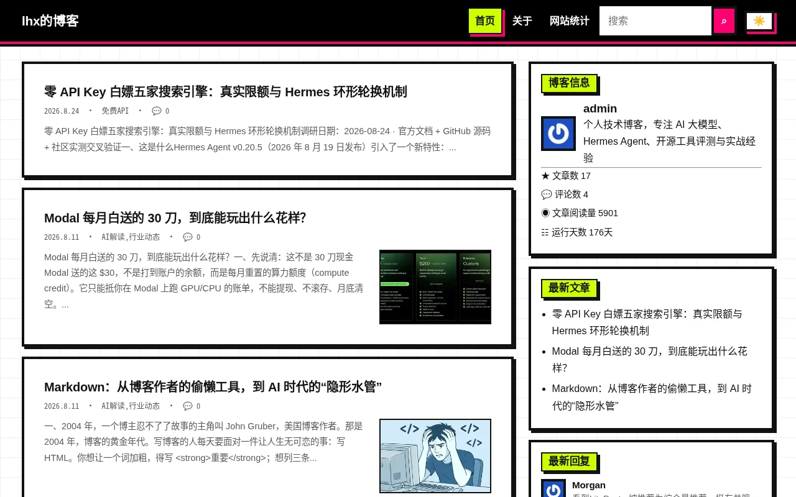
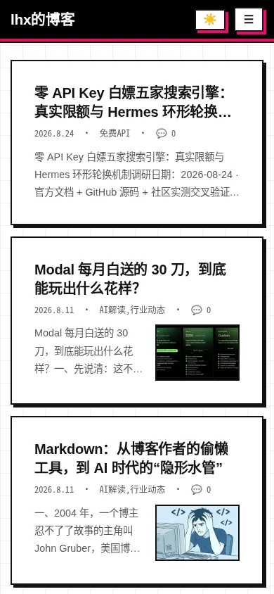
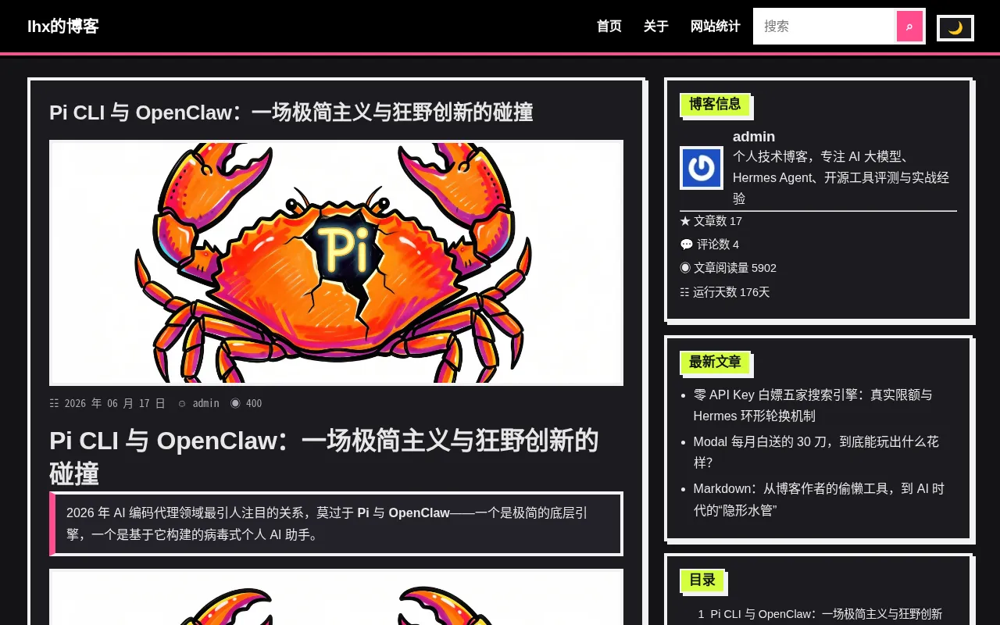

# YCLite — Typecho 博客主题

原生 CSS + 原生 JS，零前端依赖，以加载速度为第一优先级。

  

  
  

## 灵感来源

- 博客骨架与功能设计的灵感来自 [changbin1997/Facile](https://github.com/changbin1997/Facile)（MIT），YCLite 在此基础上用原生技术栈彻底重写。
- 视觉风格严格对照 [Neo-Brutalist 风格规范](https://luckymaomi.github.io/ui/styles/neo-brutalist/)（0 圆角、4px 纯黑边框、8px 硬阴影、黑白打底 + 高饱和强调色，交互见 [showcase](https://luckymaomi.github.io/ui/styles/neo-brutalist/showcase/)）。

## 性能（实测）

| 指标 | 数值 |
|---|---|
| 首屏主题资源 | 2 个（`style.css` 28KB + `main.js` 1.4KB，module 天然 defer） |
| 首页总传输 | 约 157KB / 20 请求（含全部图片，无第三方请求） |
| 构建工具 / npm 包 | 0，上传即用 |
| jQuery / Bootstrap / PJAX / 图标字体 / ECharts | 全部删除（合计减负约 900KB） |
| 首屏内联关键 CSS | 约 1KB（`@layer critical` 最弱层，正式样式永远优先） |

实现手段：单文件 CSS（`@layer` 分层）+ ESM 按需 `import()`（代码高亮、灯箱、Emoji 数据、二维码、公式、图表只在用到的页面加载）；图片原生 `loading="lazy"` + 首图 `fetchpriority`；静态资源 `?v=` 指纹 + SW 运行时缓存 + HTML 永不缓存；站内链接 speculationrules 预渲染（替代 PJAX，无刷新体验、评论零兼容问题）。

## 功能

- 黑顶栏 + 粉线 + 网格纸纹 + 酸绿面包屑的 brutal 外壳，阅读区保持克制
- 浅色 / 深色 / 跟随系统（切换系统主题实时跟随，未手动选择时）
- 列表两种卡片、摘要 + 分类/评论 meta 行、点击加载更多（可配数字分页）
- 文章目录（桌面 sticky + 移动端 dialog）、代码高亮 4 档 + 自定义 CSS、复制按钮、行号
- `<dialog>` 灯箱（居中 + 缩放 + 键盘，旧浏览器降级）、点赞、打赏/分享（二维码懒生成）
- 评论 Emoji（光标处插入）、图片验证码（GD 算术题，可选）、QQ 头像、Gravatar 源
- 统计页原生 donut + 热力图（零图表库）、标签文字云、友链三处管理 + 可视化编辑器
- SEO：canonical、搜索/日期/作者页 noindex 开关、站外链自动 `target + noopener`
- 后台 10 组 51 项设置（标记分组，增删不乱序）+ 配置导入导出

## 安装

在 [Releases](https://github.com/lihaoxi001/FCLite/releases) 下载最新 zip，解压到 `usr/themes/YCLite`，后台启用即可。旧主题的配置备份 JSON 可直接导入（同名项自动恢复）。

## 截图说明

本 README 的截图全部由本服务器的无头浏览器（Chromium + Playwright）实机渲染后裁剪导出为 WebP，存于 `assets/screenshots/`，与线上效果 1:1。后台主题列表预览图为同源 `screenshot.jpg`。

## 开发

- 约定见 `AGENTS.md`；体积预算 `style.css ≤ 35KB / main.js ≤ 12KB`
- 验证：`php -l` 全文件、`node --check` 全 JS、无 jQuery/Bootstrap 残留、`scrollWidth` 双端检查

## 致谢

- [Facile](https://github.com/changbin1997/Facile)（MIT License）——灵感与起点
- [Neo-Brutalist 风格库](https://luckymaomi.github.io/ui/styles/neo-brutalist/)——视觉规范
